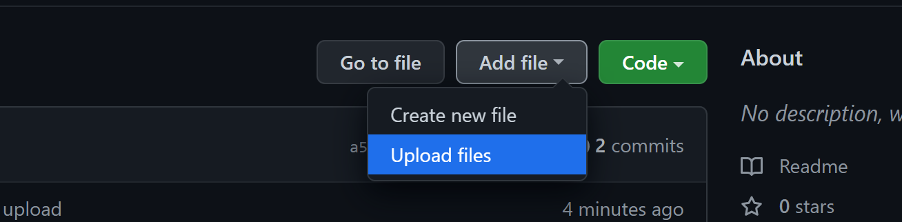
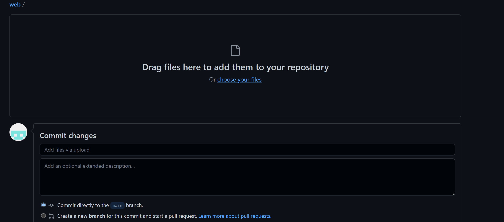
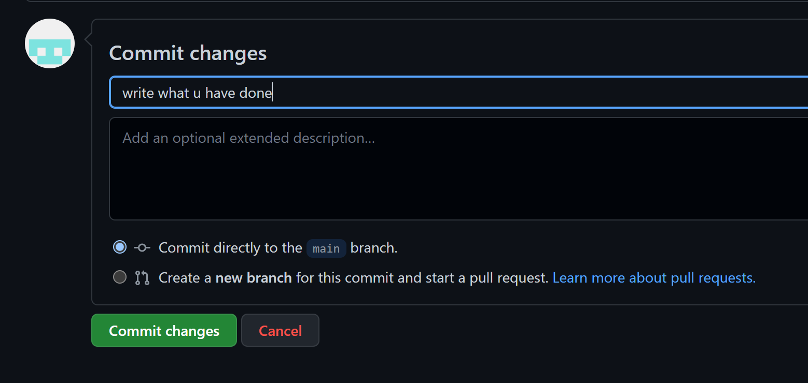

### Basic.png is the pic 
### create web page using css and html

# How to upload files
### 1) Cick on add file 

### 2) Select upload file

### 3) Click on choose files or drag files into that box.

### 4) write what u have done in commit changes.

### 5)Click in commint chages button

